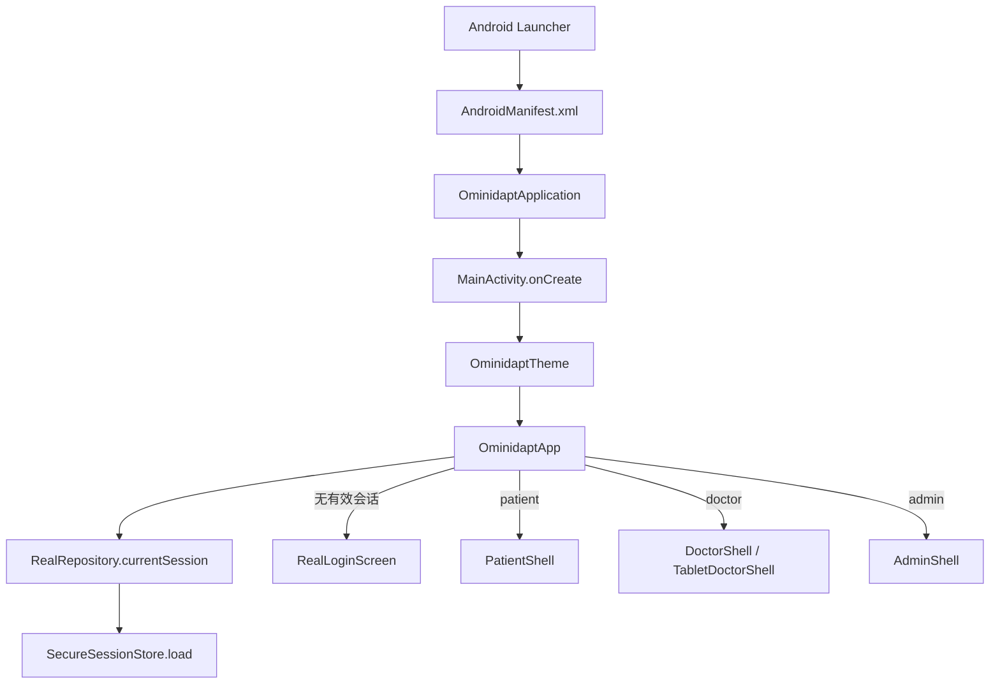

# Ominidapt PD 源码学习手册

> 面向没有软件开发经验的项目负责人。本手册按学习章节逐步补充，不把全部实现一次性压缩成结论。
>
> 状态标记：**真实**＝连接真实后端或实际执行算法；**模拟设备**＝只连接明确声明为科研模拟的 BLE 设备；**演示兼容**＝来自 `MockRepository` 的内存数据或旧前端占位数据。

## 学习路线与进度

- [x] 第 1 章：Android 主应用如何启动、恢复登录并选择角色页面
- [ ] 第 2 章：工程数据结构、Room 本地数据库、离线队列和 Repository 边界
- [ ] 第 3 章：BLE 协议、电脑模拟器、分片重组和 LFP 接收
- [ ] 第 4 章：LFP 的五维特征、GMM 快速/稳态推理与图表显示
- [ ] 第 5 章：四状态初始化、Fisher 个体化频段和模型审核
- [ ] 第 6 章：患者问卷、Gaussian Process、医生审核、BLE 下发和 ACK
- [ ] 第 7 章：FastAPI、PostgreSQL、Redis/Worker、MinIO、权限和审计
- [ ] 第 8 章：导出、聊天、测试、Docker 部署与已知未完成项

## 0. 先认清仓库的几个顶层目录

这一节只建立地图，暂不展开内部实现。

| 路径 | 作用 | 当前性质 |
|---|---|---|
| `app/` | 华为平板上安装的 Ominidapt PD 主 APK | 主产品；真实链路与旧前端兼容代码并存 |
| `protocol/` | Android 主应用与模拟器共享的 BLE UUID、帧和数据结构 | 真实执行，但只允许科研模拟设备 |
| `simulator/` | 早期 Android 手机 BLE 外设模拟器 | 保留、不作为当前电脑模拟方案的数据源 |
| `backend/` | FastAPI 接口、数据库模型、算法、Worker、导出 | 真实后端 |
| `deploy/` | Docker Compose、环境变量样例 | 电脑服务器部署入口 |
| `tools/ble_pc/` | Windows 电脑端 BLE 模拟刺激器 | 当前实际模拟设备数据源 |
| `tools/data_prep/` | P001 脱敏数据生成工具 | 本地科研数据处理 |
| `private_data/` | 本机脱敏数据和构建输入 | Git 忽略，不应上传 |
| `pages/`、`static/`、根目录 `App.vue` 等 | 早期 uni-app 前端残留 | 当前 Android Gradle 构建不使用 |

Gradle 实际纳入构建的模块由 `settings.gradle.kts` 决定，目前只有 `:app`、`:protocol`、`:simulator`。看到仓库里的文件，不等于它一定会进入平板 APK。

---

# 第 1 章：主应用启动、登录恢复和角色路由

## 1.1 本章解决什么问题

本章回答五个问题：

1. 点击平板桌面图标后，Android 最先执行哪个文件？
2. `RealRepository` 和 `BleCentralClient` 在哪里创建？
3. 为什么重启应用后可能直接回到患者或医生页面？
4. 登录成功后，程序怎样知道进入医生端还是患者端？
5. 当前启动链路中哪些是真实实现，哪些仍是演示兼容代码？

## 1.2 启动调用链总览



要先记住一个 Android 规则：系统先创建 `Application`，再创建 `Activity`。但 `OminidaptApplication` 中两个对象使用 Kotlin `lazy`，所以对象本身会等到第一次访问才真正构造。

## 1.3 文件一：`app/src/main/AndroidManifest.xml`

### 当前模块解决什么问题

Manifest 不是业务代码，而是 Android 系统读取的应用“登记表”。它声明：

- 应用类是 `.real.OminidaptApplication`；
- 桌面入口 Activity 是 `.MainActivity`；
- 主应用需要网络、BLE 扫描/连接、通知和前台服务权限；
- BLE 硬件不是安装必需条件，但没有 BLE 就不能完成设备链路；
- `BleConnectionService` 是不允许其他应用直接启动的内部服务。

### 入口在哪里

- `<application android:name=".real.OminidaptApplication">`
- 带有 `MAIN` 和 `LAUNCHER` intent-filter 的 `.MainActivity`

### 输入与输出

- 输入：APK 中合并后的 Manifest、Android 系统版本和用户授予的权限。
- 输出：系统创建指定的 `Application`/`Activity`；系统允许或拒绝网络、BLE、前台服务操作。

### 容易忽略的 Debug/Release 差异

正式 Manifest 设置 `usesCleartextTraffic="false"`，Release 理论上只允许 HTTPS。`app/src/debug/AndroidManifest.xml` 在 Debug 包中把它覆盖成 `true`，从而允许平板访问局域网 `http://电脑IP:8000`。

## 1.4 文件二：`OminidaptApplication.kt`

路径：`app/src/main/java/com/omnidapt/pd/real/OminidaptApplication.kt`

### 当前模块解决什么问题

它提供进程级单例，避免每个页面各建一套数据库、网络仓库或 BLE 客户端。

### 入口在哪里

Android 根据 Manifest 自动调用 `OminidaptApplication`。代码没有重写 `onCreate()`，真正重要的是两个惰性属性：

- `realRepository: RealRepository`
- `bleClient: BleCentralClient`

### 输入与输出

- 输入：Android `Application` 上下文。
- 输出：整个 App 共享的 `RealRepository` 和 `BleCentralClient` 实例。

`RealRepository` 在 `MainActivity` 取用 `realRepository` 时就会创建；`bleClient` 通常在进入患者/医生页面时才会创建。

## 1.5 文件三：`MainActivity.kt` 的 `MainActivity.onCreate`

路径：`app/src/main/java/com/omnidapt/pd/MainActivity.kt:215`

### 当前模块解决什么问题

这是主 APK 的 Kotlin UI 启动入口。它把传统 Android 窗口切换到 Jetpack Compose UI，并把全局真实 Repository 交给根组件。

### 关键函数

- `enableEdgeToEdge()`：允许界面绘制到系统栏区域。
- `setContent { ... }`：开始 Compose UI 树。
- `OminidaptTheme { ... }`：提供统一颜色、字体和组件主题。
- `OminidaptApp(realRepository = ...)`：进入业务路由根节点。

### 输入与输出

- 输入：系统传来的 `Bundle?`、`OminidaptApplication.realRepository`。
- 输出：一棵可响应状态变化的 Compose UI 树。

它本身不登录、不扫描蓝牙、不计算脑电；它只是把正确的依赖交到 UI 根部。

## 1.6 文件四：`MainActivity.kt` 的 `OminidaptApp`

路径：`app/src/main/java/com/omnidapt/pd/MainActivity.kt:230`

### 当前模块解决什么问题

这是主应用的角色路由器。它维护 `role` 状态，并根据服务器会话选择登录、患者、医生或管理员界面。

### 入口和调用关系

1. `MainActivity` 调用 `OminidaptApp(realRepository = ...)`。
2. `realRepository.currentSession()` 从加密会话存储读取上次登录。
3. 只有会话存在且 `mustChangePassword == false` 时才恢复角色。
4. `String.toAppRole()` 把服务器字符串 `patient/doctor/admin` 转换成前端枚举 `UserRole`。
5. `when(activeRole)` 决定显示哪个 Shell。

### 输入

- `realRepository: RealRepository?`：正式运行时非空；Compose Preview 或某些旧测试可能为空。
- `repository: MockRepository`：默认每次根组件创建时生成的旧演示仓库。

### 输出

- `null` → `RealLoginScreen`（正式运行）或旧 `LoginScreen`（只有没有真实 Repository 时）。
- `Patient` → `PatientShell`。
- `Doctor` → `DoctorShell`，内部进入原有平板医生前端。
- `Admin` → `AdminShell`。

### 必须明确的真实/模拟边界

这里存在一个过渡架构：

- **真实**：正式登录由 `RealLoginScreen → RealRepository → FastAPI` 完成；身份由服务器返回，用户不能自行选角色。
- **真实**：患者/医生 Shell 同时收到共享的 `BleCentralClient`，因此可以连接电脑 BLE 模拟器。
- **演示兼容**：`MockRepository` 仍然无条件作为默认参数创建，并传入患者/医生旧前端。一些尚未完全迁移的数据卡片可能继续读它的硬编码患者、报告、图表或状态。
- **不会在正式启动出现**：旧 `LoginScreen` 只有 `realRepository == null` 时使用，主要面向 Preview/旧测试。

判断一块 UI 是否已真实化时，不要只看它出现在 `PatientShell` 或 `DoctorShell`；还要继续追踪其数据究竟来自 `realRepository`、`bleClient`，还是 `repository: MockRepository`。

## 1.7 文件五：`RealLoginScreen`、`RealRepository` 与网络登录

涉及文件：

- `real/ui/RealEntryScreens.kt:45`：登录表单和 UI 状态。
- `real/RealRepository.kt:62`：业务数据访问门面。
- `real/network/OminidaptApi.kt:17`：REST 接口声明。
- `real/network/ApiFactory.kt:13`：创建 Retrofit/OkHttp 客户端。
- `real/security/SecureSessionStore.kt:14`：加密保存 Token 和角色。

### 登录输入

`RealLoginScreen` 收集：

- `server`：例如 `http://192.168.1.10:8000`；
- `username`；
- `password`。

点击登录后，协程调用：

```text
RealLoginScreen
  → RealRepository.login(server, username, password)
  → ApiFactory.create(authenticated = false)
  → OminidaptApi.login(LoginBody)
  → POST /auth/login
```

### 登录输出

后端返回 `TokenResponse`，Repository 把它转换成 `AuthSession`：

- access token；
- refresh token；
- 用户 ID、账号、显示名；
- 角色字符串；
- 是否强制首次改密。

随后：

1. `SecureSessionStore.save()` 用 Android Keystore 中的 AES-GCM 密钥加密整个会话，再写入 SharedPreferences。
2. 如果不需要改密，`refreshPatients()` 从服务器拉取当前账号可访问患者并写入 Room。
3. `scheduleSync()` 安排断网事件补传。
4. UI 用 `onLogin(role)` 修改 `OminidaptApp` 的 `role` 状态，Compose 自动切换页面。

### 首次改密分支

若 `mustChangePassword == true`：

- 不进入业务页；
- 登录页显示新密码与确认框；
- 调用 `RealRepository.changePassword()`；
- 后端返回新 Token 后才执行 `onLogin()`。

### Token 自动刷新

业务接口由 `ApiFactory.create(authenticated = true)` 创建。OkHttp 拦截器给请求加上 `Authorization: Bearer ...`。收到未授权响应时，Authenticator 用 refresh token 调 `/auth/refresh`，保存新会话，并重试原请求；重复失败则清空会话。

## 1.8 本章完整执行例子

假设平板首次安装后，医生输入服务器、账号和密码：

1. Android 从 Manifest 找到 `OminidaptApplication` 和 `MainActivity`。
2. `MainActivity.onCreate()` 创建 Compose UI，并第一次取用 `realRepository`。
3. `OminidaptApp` 没读到旧会话，因此显示 `RealLoginScreen`。
4. 登录页把三个字符串传给 `RealRepository.login()`。
5. Retrofit 发送 `POST /auth/login`。
6. 后端校验密码，返回角色 `doctor` 和两种 Token。
7. 会话在平板上加密保存；患者摘要写入 Room。
8. `onLogin(UserRole.Doctor)` 改变 `role`。
9. Compose 重新组合，进入 `DoctorShell`。
10. `DoctorShell` 同时拿到旧 `MockRepository`、真实 `RealRepository` 和共享 `BleCentralClient`；下一章开始逐块辨认它们各自负责的数据。

重启应用时，第 3～7 步通常不会重做：`OminidaptApp` 从加密会话恢复角色。access token 到期后，第一次业务请求会触发自动刷新。

## 1.9 建议你亲自阅读的 5 段代码

按以下顺序阅读，不要先陷入几千行 UI 细节：

1. `app/src/main/AndroidManifest.xml` 中 `<application>`、`<activity>`、`<service>`：确认谁由系统创建。
2. `real/OminidaptApplication.kt:6-9`：理解进程共享对象和 `lazy`。
3. `MainActivity.kt:215-228`：理解 Android Activity 怎样进入 Compose。
4. `MainActivity.kt:230-309`：逐个画出 `role` 的四个分支，特别标出 `MockRepository` 与 `RealRepository` 同时存在。
5. `real/ui/RealEntryScreens.kt:132-169` 加 `real/RealRepository.kt:81-102`：把一次点击登录从 UI 一直追到 Token 存储。

阅读方法：每看到一个函数调用，先写下“传入了什么类型、返回了什么类型、是否会修改持久状态”，不要急着理解 Compose 的所有语法。

## 1.10 本章自测（先不要看答案）

1. 点击桌面图标后，`OminidaptApplication` 和 `MainActivity` 哪个先由 Android 创建？为什么 `BleCentralClient` 仍可能稍后才创建？
2. 正式运行时，登录页为什么不能由用户自行选择“医生/患者”？最终角色来自哪个数据结构的哪个字段？
3. `OminidaptApp` 同时拿着 `MockRepository` 和 `RealRepository` 意味着什么？你会怎样判断某个图表目前是否是真实数据？
4. 登录成功后，哪些内容会持久保存？哪些内容只存在于 Compose 的 `role` 状态中？
5. Debug APK 为什么能访问局域网 HTTP，而 Release 配置原则上不能？请指出两个 Manifest 文件。

回答完这些问题后，再进入第 2 章。第 2 章会从 `RealRepository` 向下拆开 Room、REST、离线队列和数据模型，并选一个患者记录实际追踪“服务器 → Room → UI”。
